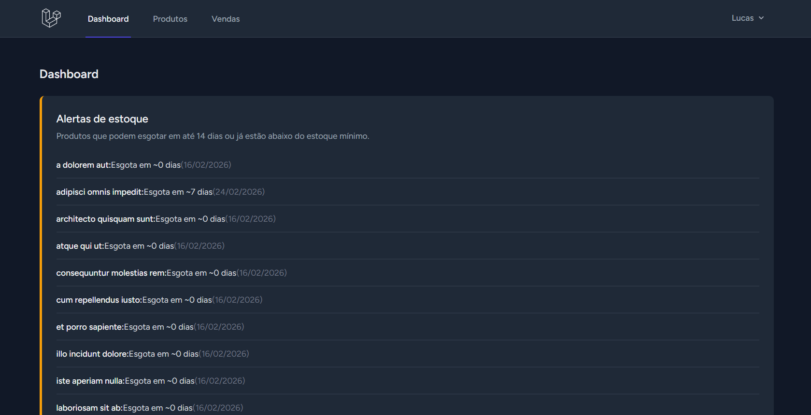
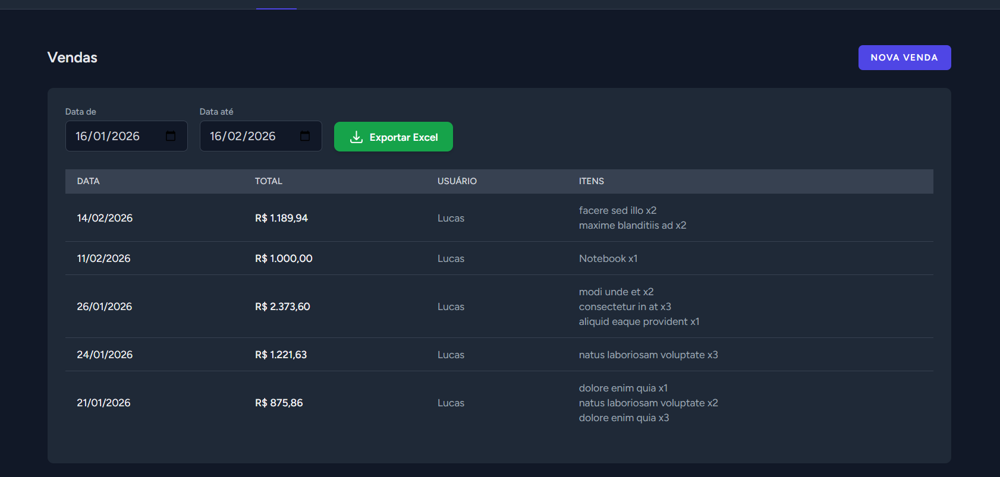

# Smart Inventory AI

[](https://www.php.net/)
[](https://laravel.com)
[](https://livewire.laravel.com)
[](LICENSE)

Sistema de controle de estoque com **previsão de esgotamento por IA**, sugestão de reposição e dashboard analítico. Desenvolvido com Laravel, Livewire e um serviço de predição em Python (FastAPI + pandas/scikit-learn).

---

## Sobre o projeto

O **Smart Inventory AI** é um projeto full-stack que une:

- **Backend web** em PHP (Laravel 12) com autenticação (Breeze), CRUD de produtos e vendas, e exportação em Excel.
- **Interface reativa** com Livewire e Tailwind CSS.
- **Módulo de IA** em Python: API REST que recebe histórico de vendas e estoque, calcula a taxa de consumo e devolve a data prevista de esgotamento por produto. O Laravel consome essa API, persiste as previsões e exibe alertas e sugestões no dashboard.

O sistema detecta automaticamente produtos em risco (estoque baixo ou que vão esgotar em poucos dias), sugere quantidades para repor e mostra a tendência de vendas em um gráfico semanal.

---

## Funcionalidades

| Módulo | Descrição |
|--------|-----------|
| **Produtos** | CRUD completo (nome, SKU, descrição, preço, estoque atual, estoque mínimo). Listagem com busca e coluna de previsão de esgotamento. |
| **Vendas** | Registro de vendas com múltiplos itens; estoque atualizado automaticamente. Filtros por data e exportação em Excel (.xlsx). |
| **Dashboard** | Alertas de estoque (produtos em risco), **gráfico de tendência de vendas** (últimas 12 semanas) e **sugestão de reposição** com quantidade recomendada por produto. |
| **Previsão por IA** | Serviço Python consome histórico e estoque; Laravel chama a API, grava previsões na base e agenda atualização diária (ex.: 6h). |

---

## Stack tecnológica

- **Backend:** PHP 8.2+, Laravel 12, Livewire 3, Laravel Breeze (auth), Maatwebsite Excel
- **Frontend:** Blade, Tailwind CSS, Alpine.js, Chart.js
- **IA/Previsão:** Python 3.12, FastAPI, pandas, scikit-learn
- **Banco:** MySQL 8
- **Ambiente:** Docker (app PHP, MySQL, serviço predictor em Python)

---

## Screenshots

| Dashboard (alertas + tendência + sugestão de reposição) | Vendas (sistema de registro de vendas) | Produtos (com previsão de esgotamento) | Gráficos (vendas + alerta de estoque) |
|---|---|---|---|
|  |  |  |  |


---

## Estrutura do projeto

```
smart-inventory-ai/
├── app/
│   ├── Console/Commands/RefreshPredictionsCommand.php   # Comando para atualizar previsões
│   ├── Livewire/                                        # Componentes Livewire (Dashboard, Produtos, Vendas)
│   ├── Models/                                          # Product, Sale, SaleItem, Prediction
│   └── Services/                                        # ProductService, SaleService, StockPredictionService
├── python/                                              # API de previsão (FastAPI)
│   ├── main.py                                          # POST /predict, lógica com pandas
│   ├── requirements.txt
│   └── Dockerfile
├── database/migrations/                                 # products, sales, sale_items, predictions
├── routes/web.php
└── docker-compose.yml                                   # app, mysql, predictor
```

---

## Pré-requisitos

- [Docker](https://www.docker.com/) e Docker Compose (recomendado), **ou**
- PHP 8.2+, Composer, Node.js, MySQL (ou SQLite para testes)

---

## Instalação e execução

### Com Docker (recomendado)

1. **Clone o repositório e entre na pasta:**

   ```bash
   git clone https://github.com/SEU_USUARIO/smart-inventory-ai.git
   cd smart-inventory-ai
   ```

2. **Configure o ambiente:**

   ```bash
   cp .env.example .env
   # Edite .env: DB_HOST=mysql, DB_USERNAME=laravel, DB_PASSWORD=secret, DB_DATABASE=smart_inventory_ai
   # Opcional: PREDICTOR_URL=http://predictor:8000 (já é o padrão com Docker)
   ```

3. **Suba os containers (app + MySQL + predictor):**

   ```bash
   docker compose up -d --build
   ```

4. **Gere a chave da aplicação e rode as migrações:**

   ```bash
   docker compose exec app php artisan key:generate
   docker compose exec app php artisan migrate --force
   ```

5. **(Opcional) Dados de exemplo (30 produtos e 30 vendas):**

   ```bash
   docker compose exec app php artisan db:seed
   ```

6. **(Opcional) Atualizar previsões de estoque (chama a API Python):**

   ```bash
   docker compose exec app php artisan predictions:refresh
   ```

7. **Acesse a aplicação:**

   - **App:** [http://localhost:8000](http://localhost:8000)  
   - **API de previsão (health):** [http://localhost:8001/health](http://localhost:8001/health)

   Crie um usuário em **Register** e use **Dashboard**, **Produtos** e **Vendas** no menu.

### Sem Docker

1. PHP 8.2+, Composer, Node, MySQL instalados.
2. `composer install`, `cp .env.example .env`, `php artisan key:generate`.
3. Configure `.env` com as credenciais do MySQL.
4. `php artisan migrate`, `npm install`, `npm run build`.
5. Suba a API Python (na pasta `python/`): `pip install -r requirements.txt` e `uvicorn main:app --reload`.
6. No `.env` do Laravel: `PREDICTOR_URL=http://127.0.0.1:8000` (porta em que o uvicorn está rodando).
7. `php artisan serve` e acesse [http://localhost:8000](http://localhost:8000) (ou a porta que o `serve` indicar).

---

## Variáveis de ambiente principais

| Variável | Descrição | Exemplo (Docker) |
|----------|-----------|-------------------|
| `DB_HOST` | Host do banco | `mysql` |
| `DB_DATABASE` | Nome do banco | `smart_inventory_ai` |
| `DB_USERNAME` / `DB_PASSWORD` | Credenciais MySQL | `laravel` / `secret` |
| `PREDICTOR_URL` | URL do serviço de previsão | `http://predictor:8000` |
| `PREDICTOR_TIMEOUT` | Timeout da chamada à API (segundos) | `30` |

---

## Agendamento (previsões)

O comando `predictions:refresh` está agendado para rodar **diariamente às 06:00** (definido em `bootstrap/app.php`). Para o agendamento ser executado, é necessário um cron no host:

```bash
* * * * * cd /caminho/do/projeto && php artisan schedule:run >> /dev/null 2>&1
```

Em ambiente Docker, o cron pode rodar dentro do container `app` ou em um worker separado.

---

## Testes

```bash
php artisan test

php artisan test tests/Livewire
```

Os testes usam banco em memória (SQLite) e cobrem listagem/criação/edição/exclusão de produtos, registro de vendas com atualização de estoque e exportação Excel.

---

## API de previsão (Python)

- **Endpoint:** `POST /predict`
- **Body:** `{ "products": [{ "id", "stock_quantity" }, ...], "sales_history": [{ "product_id", "sold_at", "quantity" }, ...] }`
- **Resposta:** `{ "predictions": [{ "product_id", "predicted_until", "predicted_quantity", "days_until_stockout" }, ...] }`

A lógica usa a média de unidades vendidas por dia (janela configurável, ex.: 90 dias) e estima a data em que o estoque chega a zero.

---

## Licença

Este projeto está sob a licença [MIT](LICENSE).

---

## Autor

Projeto desenvolvido como vitrine de portfólio. Se tiver dúvidas ou sugestões, sinta-se à vontade para abrir uma issue ou um pull request.
