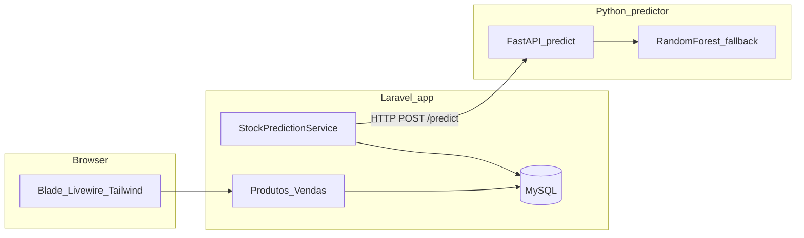
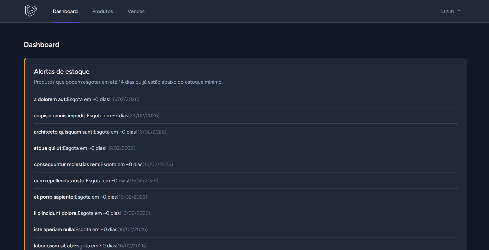
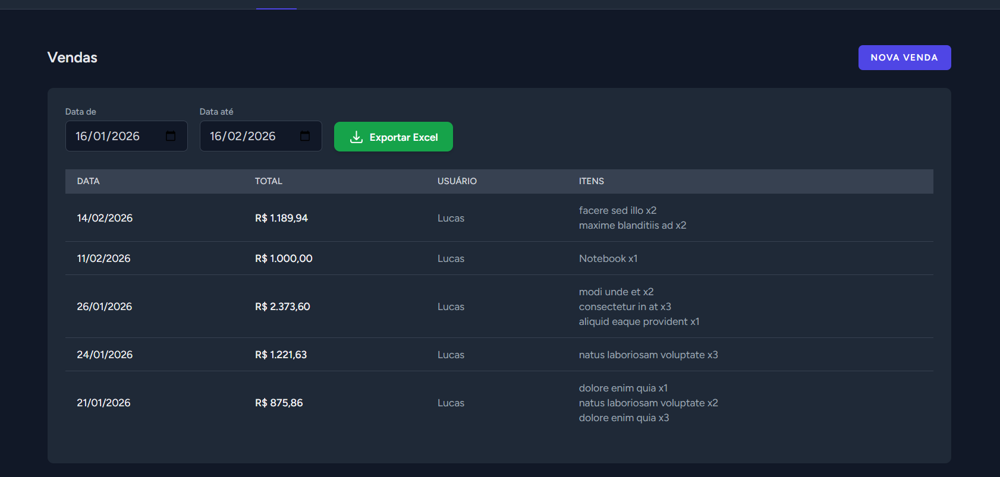

# Smart Inventory AI

[](https://github.com/suassuluc/Smart_IA_Stock/actions/workflows/ci.yml)
[](https://www.php.net/)
[](https://laravel.com)
[](https://livewire.laravel.com)
[](LICENSE)

Sistema de controle de estoque com **previsão de esgotamento por IA**, sugestão de reposição e dashboard analítico. Desenvolvido com Laravel, Livewire e um serviço de predição em Python (FastAPI + pandas/scikit-learn).

---

## Sobre o projeto

O **Smart Inventory AI** é um projeto full-stack que une:

- **Backend web** em PHP (Laravel 12) com autenticação (Breeze), CRUD de produtos e vendas, e exportação em Excel.
- **Interface reativa** com Livewire e Tailwind CSS.
- **Módulo de IA** em Python: API REST (FastAPI) que recebe histórico de vendas e estoque. Um modelo de **machine learning** (scikit-learn) aprende padrões de venda (sazonalidade semanal, tendência, consumo recente) e prevê o consumo diário esperado; com isso calcula a data prevista de esgotamento por produto. Quando há poucos dados, o serviço usa fallback por média simples. O Laravel consome essa API, persiste as previsões e exibe alertas e sugestões no dashboard.

O sistema detecta automaticamente produtos em risco (estoque baixo ou que vão esgotar em poucos dias), ordena os alertas pelos mais críticos (estoque abaixo do mínimo primeiro, depois os que esgotam mais cedo, depois os de menor quantidade em estoque). A **sugestão de reposição** exibe exatamente os produtos indicados no Alerta de Estoque, nessa mesma ordem, com a quantidade sugerida para repor. O dashboard também mostra a tendência de vendas em um gráfico semanal.

---

## Funcionalidades

| Módulo | Descrição |
|--------|-----------|
| **Produtos** | CRUD completo (nome, SKU, descrição, preço, estoque atual, estoque mínimo). Listagem com busca e coluna de previsão de esgotamento. |
| **Vendas** | Registro de vendas com múltiplos itens; estoque atualizado automaticamente. Filtros por data e exportação em Excel (.xlsx). |
| **Dashboard** | **Alertas de estoque**, **gráfico de tendência de vendas** (últimas 12 semanas) e **sugestão de reposição** com os mesmos produtos do alerta, na mesma ordem, e quantidade recomendada para repor. |
| **Previsão por IA** | Serviço Python (ML com scikit-learn) aprende padrões de venda e prevê consumo; fallback por média quando há poucos dados. Laravel chama a API, grava previsões na base e agenda atualização diária (ex.: 6h). |

---

## Stack tecnológica

- **Backend:** PHP 8.3+, Laravel 12, Livewire 3, Laravel Breeze (auth), Maatwebsite Excel
- **Frontend:** Blade, Tailwind CSS, Alpine.js, Chart.js (via Vite)
- **IA/Previsão:** Python 3.12, FastAPI, pandas, scikit-learn
- **Banco:** MySQL 8
- **Ambiente:** Docker (app PHP, MySQL, serviço predictor em Python)

---

## Arquitetura


```mermaid
flowchart LR
  subgraph browser [Browser]
    UI[Blade_Livewire_Tailwind]
  end
  subgraph laravel [Laravel_app]
    CRUD[Produtos_Vendas]
    SVC[StockPredictionService]
    DB[(MySQL)]
  end
  subgraph py [Python_predictor]
    API[FastAPI_predict]
    ML[RandomForest_fallback]
  end
  UI --> CRUD
  CRUD --> DB
  SVC -->|"HTTP POST /predict"| API
  API --> ML
  SVC --> DB
```

Integração HTTP: [`app/Services/StockPredictionService.php`](app/Services/StockPredictionService.php) envia o payload para `PREDICTOR_URL/predict` e persiste o resultado em `predictions`.

---

## Screenshots

| Dashboard | Vendas | Produtos | Gráficos |
|-----------|--------|----------|----------|
|  |  |  |  |

Os arquivos em `docs/` são imagens mínimas válidas (placeholder). Para o portfólio no GitHub, substitua por capturas reais da aplicação mantendo os mesmos nomes ou atualize as referências neste README (ver [CONTRIBUTING.md](CONTRIBUTING.md)).

---

## Pré-requisitos

- [Docker](https://www.docker.com/) e Docker Compose (recomendado), **ou**
- PHP 8.3+, Composer, Node.js 22+ (recomendado para Vite 7), MySQL (ou SQLite para testes PHP)

---

## Instalação e execução

### Com Docker (recomendado)

1. **Clone o repositório e entre na pasta:**

   ```bash
   git clone https://github.com/suassuluc/Smart_IA_Stock.git
   cd Smart_IA_Stock
   ```

2. **Configure o ambiente:**

   ```bash
   cp .env.example .env
   # Edite .env: DB_HOST=mysql, DB_USERNAME=laravel, DB_PASSWORD=secret, DB_DATABASE=smart_inventory_ai
   # Opcional: PREDICTOR_URL=http://predictor:8000 (já é o padrão com Docker)
   ```

   O healthcheck do MySQL usa a mesma senha definida em `MYSQL_ROOT_PASSWORD` (derivada de `DB_PASSWORD` no compose). Se alterar `DB_PASSWORD`, mantenha coerência em todo o `.env` usado pelo Compose.

3. **Suba os containers (app + MySQL + predictor):**

   ```bash
   docker compose up -d --build
   ```

4. **Gere a chave da aplicação e rode as migrações:**

   ```bash
   docker compose exec app php artisan key:generate
   docker compose exec app php artisan migrate --force
   ```

5. **(Opcional) Dados de exemplo (30 produtos e 30 vendas):**

   ```bash
   docker compose exec app php artisan db:seed
   ```

6. **(Opcional) Atualizar previsões de estoque (chama a API Python):**

   ```bash
   docker compose exec app php artisan predictions:refresh
   ```

7. **Acesse a aplicação:**

   - **App:** [http://localhost:8000](http://localhost:8000)
   - **API de previsão — health:** [http://localhost:8001/health](http://localhost:8001/health)
   - **Documentação interativa da API (Swagger UI):** [http://localhost:8001/docs](http://localhost:8001/docs)

   Crie um usuário em **Register** e use **Dashboard**, **Produtos** e **Vendas** no menu.

### Sem Docker

1. PHP 8.3+, Composer, Node.js, MySQL instalados.
2. `composer install`, `cp .env.example .env`, `php artisan key:generate`.
3. Configure `.env` com as credenciais do MySQL.
4. `php artisan migrate`, `npm install`, `npm run build`.
5. Suba a API Python (na pasta `python/`): `pip install -r requirements.txt` e `uvicorn main:app --reload`.
6. No `.env` do Laravel: `PREDICTOR_URL=http://127.0.0.1:8000` (porta em que o uvicorn está a correr).
7. `php artisan serve` e acesse [http://localhost:8000](http://localhost:8000) (ou a porta que o `serve` indicar).

---

## Variáveis de ambiente principais

| Variável | Descrição | Exemplo (Docker) |
|----------|-----------|-------------------|
| `DB_HOST` | Host do banco | `mysql` |
| `DB_DATABASE` | Nome do banco | `smart_inventory_ai` |
| `DB_USERNAME` / `DB_PASSWORD` | Credenciais MySQL | `laravel` / `secret` |
| `PREDICTOR_URL` | URL do serviço de previsão | `http://predictor:8000` |
| `PREDICTOR_TIMEOUT` | Timeout da chamada à API (segundos) | `30` |

---

## Agendamento (previsões)

O comando `predictions:refresh` está agendado para rodar **diariamente às 06:00** (definido em `bootstrap/app.php`). Para o agendamento ser executado, é necessário um cron no host:

```bash
* * * * * cd /caminho/do/projeto && php artisan schedule:run >> /dev/null 2>&1
```

Em ambiente Docker, o cron pode rodar dentro do container `app` ou em um worker separado.

---

## API de previsão (Python)

- **Endpoints:** `POST /predict`, `GET /health`
- **Documentação OpenAPI:** `GET /docs` e `GET /redoc` (quando o serviço está em execução)
- **Body:** `{ "products": [{ "id", "stock_quantity" }, ...], "sales_history": [{ "product_id", "sold_at", "quantity" }, ...] }`
- **Resposta:** `{ "predictions": [{ "product_id", "predicted_until", "predicted_quantity", "days_until_stockout" }, ...] }`

A lógica principal usa **machine learning** (scikit-learn, Random Forest): o serviço monta features a partir do histórico (consumo nas últimas 1/2/4/12 semanas, tendência, sazonalidade por dia da semana, etc.), treina o modelo e prevê o consumo diário esperado; com isso calcula a data de esgotamento. Quando não há dados suficientes para treino (ex.: menos de 14 dias com vendas por produto no fluxo de features), é usado **fallback** por média simples (janela de 90 dias), mantendo o mesmo contrato da API.

### Limitações do modelo (importante para portfólio)

- É uma **demonstração técnica**: não substitui planeamento comercial, nem previsão financeira ou de procura em mercado real.
- Com **poucos dados de vendas**, o fallback por média domina; as datas são indicativas.
- O modelo não incorpora feriados, campanhas ou rupturas de fornecimento — apenas histórico de vendas e stock atual.

---

## Testes

```bash
php artisan test

php artisan test tests/Livewire
```

Os testes PHP usam SQLite em memória (ver `phpunit.xml`).

**Serviço Python:**

```bash
cd python && pytest -q
```

---

## Resolução de problemas

| Situação | O que fazer |
|----------|-------------|
| **Predictor offline** ao correr `predictions:refresh` | Verifique `PREDICTOR_URL` e se o container/serviço Python está a escutar; teste `curl http://localhost:8001/health` (Docker) ou a porta local do uvicorn. O Laravel regista falhas e pode lançar exceção — previsões antigas na base mantêm-se conforme o código atual. |
| **Compose não sobe o app** | Confirme que o MySQL passou no healthcheck; alinhe `DB_PASSWORD` no `.env` com o esperado pelo serviço `mysql`. |
| **Assets / gráfico no dashboard** | Execute `npm run build` (ou `npm run dev` em desenvolvimento); o Chart.js é empacotado via Vite (`resources/js/app.js`). |

---

## Contribuindo

Veja [CONTRIBUTING.md](CONTRIBUTING.md).

---

## Licença

Este projeto está sob a licença [MIT](LICENSE).

---

## Autor

Projeto desenvolvido como vitrine de portfólio. Dúvidas ou sugestões: issues ou pull requests no repositório.
